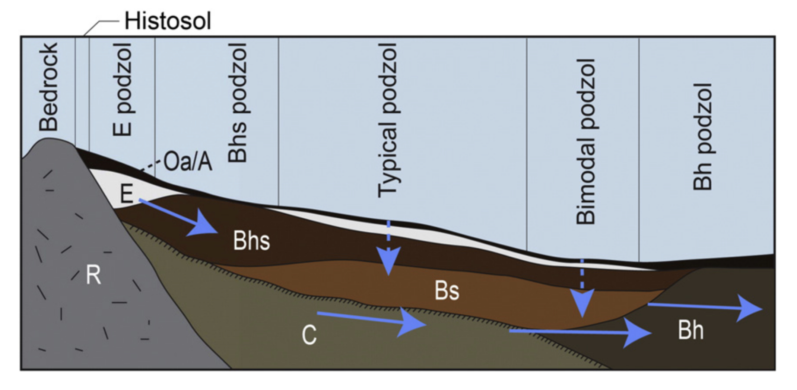

```{r setup, include=FALSE}
library(formatR)
knitr::opts_chunk$set(echo = TRUE, fig.align = "center", fig.show = "hold", time_it = TRUE, dpi = 100)
knitr::opts_chunk$set(tidy.opts = list(width.cutoff = 60), tidy = T, collapse = TRUE)
knitr::opts_knit$set(root.dir = '/Users/Anthony/OneDrive - UW/University of Washington/Data and Modeling/')

library(terra)
library(sf)
library(spatialEco)
library(lidR)
library(tidyterra)
library(dplyr)
library(whitebox)
library(MultiscaleDTM)

```

```{r echo=FALSE}
hoh_WIP <- rast("SOIL CARBON/SPATIAL LAYERS/SPATIAL_LAYERS_7_11_22/HOH/Hoh_WIP_Mask0_10_2022.tif")


```

Question: Does a continuous wetland to upland gradient exist? Or, can a catena-type model be derived using wetlands and uplands in a data-driven approach?




### Using Hubbard Brook as an example

```{r}
hbdem <- rast("data/dem1m.tif")
plot(hbdem)

hb <- vect("data/hbef_wsheds/hbef_wsheds.shp")

lines(hb)
```

```{r}
nwi <- vect("data/HU8_01070001_Watershed/HU8_01070001_Wetlands.shp") |> project("EPSG:26919")
hbnwi <- crop(nwi, ext(hbdem))
names(hbnwi)
plot(hbdem)
plot(hbnwi, "WETLAND_TY", type = "classes", add = T)
```

```{r}
hbgeo <- vect("data/hbef_bedrock/hbef_bedrock.shp")

plot(hbgeo, type = "classes")


#1 meter LiDAR-derived, Filtered Hydro-enforced Digital Elevation Model (DEM)
hb1mlpns <- rast("data/hydem1mlpns.tif") 


plot(hb1mlpns) 
```

#### Get training data - wetland and upland points

```{r}
randupl <- spatSample(hbdem, 2000, as.points = TRUE, xy = TRUE)

hbnwi_buff <- buffer(hbnwi, 50)

hbupl_pts <- terra::mask(randupl, hbnwi_buff, inverse = T) |> 
    mutate(class = "UPL") |>
    select(-dem1m)


plot(hbupl_pts, type = "points")
lines(hbnwi_buff)
```

```{r}
hbwet_pts <- spatSample(hbnwi, size = 500) |> 
    mutate(class = "WET") |>
    select(class)

plot(hbwet_pts, type = "classes")


```

```{r}
hbpts_all <- rbind(hbupl_pts, hbwet_pts) 
hbpts_ext <- terra::extract(hbdem, hbpts_all, bind = T) 
hbpts <- hbpts_ext |> dplyr::filter(!is.na(dem1m))

plot(hbdem) 
plot(hbpts, "class", type = "classes", add = T)
```


Make terrain metrics 

```{r}
hbslp_3 <- SlpAsp(hbdem, w = c(3,3), metrics = "slope", filename = "data/derived_data/hbslp_3.tif", overwrite = T)

hbslp_27 <- SlpAsp(hbdem, w = c(27,27), metrics = "slope", filename = "data/derived_data/hbslp_27.tif", overwrite = T)

hbslp_81 <- SlpAsp(hbdem, w = c(81,81), metrics = "slope", filename = "data/derived_data/hbslp_81.tif", overwrite = T)

```

```{r}
plot(hbslp_3)
plot(hbslp_27)
plot(hbslp_81)
```

```{r}
hbtpi_3 <- TPI(hbdem, w = c(3,3), 
               shape="rectangle", stand="none", na.rm = TRUE, 
               filename = "data/derived_data/hbtpi_3.tif", overwrite = T)

hbtpi_27 <- TPI(hbdem, w = c(27,27), 
                shape="rectangle", stand="none", na.rm = TRUE,
                filename = "data/derived_data/hbtpi_27.tif", overwrite = T)

hbtpi_81 <- TPI(hbdem, w = c(81,81), 
                shape="rectangle", stand="none", na.rm = TRUE,
                filename = "data/derived_data/hbtpi_81.tif", overwrite = T)

```

```{r}
plot(hbtpi_3)
plot(hbtpi_27)
plot(hbtpi_81)
```

```{r}
hbcurv_3 <- Qfit(hbdem, w = c(3,3), 
                metrics = c("meanc", "profc", "planc"), unit = "degrees", na.rm = TRUE,
               filename = "data/derived_data/hbcurv_3.tif", overwrite = T)

hbcurv_27 <- Qfit(hbdem, w = c(27,27), 
                metrics = c("meanc", "profc", "planc"), unit = "degrees", na.rm = TRUE,
                filename = "data/derived_data/hbcurv_27.tif", overwrite = T)

hbcurv_81 <- Qfit(hbdem, w = c(81,81), 
                metrics = c("meanc", "profc", "planc"), unit = "degrees", na.rm = TRUE,
                filename = "data/derived_data/hbcurv_81.tif", overwrite = T)
```

```{r}
plot(hbcurv_3)
plot(hbcurv_27)
plot(hbcurv_81)
```


